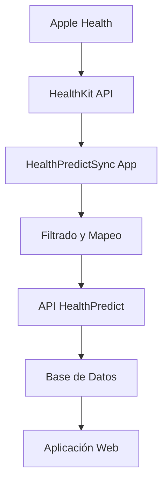

# Integración HealthPredict con Apple Health

## 📱 Resumen de la Integración

Esta integración permite sincronizar automáticamente los datos de salud desde la aplicación Apple Health de iPhone con tu plataforma HealthPredict, reemplazando los datos de prueba con información real del usuario.

## 🏗️ Arquitectura de la Solución

### Componentes Principales

1. **Aplicación iOS (HealthPredictSync)**
   - Accede a HealthKit para leer datos de salud
   - Interfaz de usuario intuitiva para configurar sincronización
   - Manejo de autorizaciones y permisos
   - Sincronización automática en segundo plano

2. **API Extensions (.NET)**
   - Nuevos endpoints para sincronización en lote
   - Mapeo de tipos de datos de HealthKit
   - Prevención de duplicados
   - Generación automática de alertas

3. **Base de Datos**
   - Almacenamiento de datos sincronizados
   - Tracking de fechas de sincronización
   - Identificación de origen de datos

## 🔧 Configuración del Backend

### 1. Endpoints Agregados

```csharp
// POST: api/DatosVitales/Sync/HealthKit
// Sincronizar datos en lote desde HealthKit

// GET: api/DatosVitales/LastSync/{usuarioId}
// Obtener última fecha de sincronización
```

### 2. Nuevos Métodos en DatoVitalService

- `CreateDatosVitalesEnLoteAsync()` - Inserción en lote con prevención de duplicados
- `GetUltimaFechaSincronizacionAsync()` - Tracking de sincronización
- `GetDatosVitalesParaSincronizarAsync()` - Sincronización incremental

### 3. Mapeo de Tipos de Datos

| HealthKit | HealthPredict |
|-----------|---------------|
| HKQuantityTypeIdentifierHeartRate | frecuencia_cardiaca |
| HKQuantityTypeIdentifierBloodPressureSystolic | presion_sistolica |
| HKQuantityTypeIdentifierBloodPressureDiastolic | presion_diastolica |
| HKQuantityTypeIdentifierBodyTemperature | temperatura_corporal |
| HKQuantityTypeIdentifierOxygenSaturation | saturacion_oxigeno |
| HKQuantityTypeIdentifierStepCount | pasos |
| HKQuantityTypeIdentifierBodyMass | peso |
| HKQuantityTypeIdentifierHeight | altura |

## 📱 Configuración de la App iOS

### 1. Requisitos del Sistema

- iOS 16.0 o superior
- Xcode 15.0 o superior
- Dispositivo físico con HealthKit (no funciona en simulador)
- Apple Developer Account (para certificados)

### 2. Configuración en Xcode

1. **Abrir el proyecto:**
   ```bash
   cd HealthPredictSync
   open HealthPredictSync.xcodeproj
   ```

2. **Configurar Bundle Identifier:**
   - Cambiar `com.healthpredict.sync` por tu identificador único
   - Configurar tu Team de desarrollo

3. **Configurar URL de la API:**
   ```swift
   // En APIService.swift, línea 4
   private let baseURL = "https://tu-api-healthpredict.com/api"
   ```

4. **Permisos necesarios:**
   - HealthKit capability habilitada
   - Permisos de lectura configurados en `HealthKitConfiguration.swift`

### 3. Compilación y Despliegue

```bash
# Compilar para dispositivo
xcodebuild -project HealthPredictSync.xcodeproj -scheme HealthPredictSync -destination 'platform=iOS,name=iPhone' build

# O usar Xcode directamente
# Product -> Build (Cmd+B)
# Product -> Run (Cmd+R)
```

## 🔐 Configuración de Permisos

### 1. Permisos de HealthKit

La app solicita permisos para leer:
- ❤️ Signos vitales (frecuencia cardíaca, presión arterial, temperatura)
- 🏃‍♂️ Actividad física (pasos, distancia, calorías)
- ⚖️ Métricas corporales (peso, altura, IMC)
- 🍎 Datos nutricionales (calorías consumidas, agua)

### 2. Configuración de Privacidad

```xml
<!-- Info.plist -->
<key>NSHealthShareUsageDescription</key>
<string>Esta aplicación necesita acceso a tus datos de salud para sincronizarlos con HealthPredict y brindarte análisis personalizados.</string>
```

## 🚀 Cómo Usar la Integración

### 1. Primera Configuración

1. **Instalar la aplicación** en tu iPhone
2. **Autorizar HealthKit** cuando se solicite
3. **Configurar la URL de tu API** en el código
4. **Verificar conexión** con el servidor

### 2. Proceso de Sincronización

1. **Abrir HealthPredictSync**
2. **Seleccionar tipos de datos** a sincronizar
3. **Elegir rango de fechas** (últimos 7 días por defecto)
4. **Presionar "Sincronizar Datos"**
5. **Verificar resultados** en tu aplicación web

### 3. Sincronización Automática

La app puede configurarse para sincronización automática:
- Diaria en segundo plano
- Cuando se agregan nuevos datos
- Notificaciones de sincronización exitosa

## 📊 Tipos de Datos Soportados

### Signos Vitales
- **Frecuencia Cardíaca** (latidos/min)
- **Presión Arterial** (mmHg) - Sistólica y Diastólica
- **Temperatura Corporal** (°C)
- **Saturación de Oxígeno** (%)
- **Frecuencia Respiratoria** (respiraciones/min)

### Actividad Física
- **Pasos** (count)
- **Distancia Caminada** (metros)
- **Calorías Activas** (kcal)
- **Calorías Basales** (kcal)

### Métricas Corporales
- **Peso** (kg)
- **Altura** (m)
- **Índice de Masa Corporal** (kg/m²)
- **Porcentaje de Grasa Corporal** (%)

### Nutrición
- **Calorías Consumidas** (kcal)
- **Agua Consumida** (litros)

## 🔧 Configuración Avanzada

### 1. Personalizar Tipos de Datos

```swift
// En HealthKitConfiguration.swift
static let readTypes: Set<HKObjectType> = [
    // Agregar nuevos tipos aquí
    HKQuantityType.quantityType(forIdentifier: .bloodGlucose)!,
    // ...
]
```

### 2. Configurar Sincronización Automática

```swift
// En HealthKitManager.swift
func enableBackgroundDelivery() {
    // Configurar frecuencia de sincronización
    healthStore.enableBackgroundDelivery(for: quantityType, frequency: .daily)
}
```

### 3. Personalizar Mapeo de Datos

```swift
// En DatosVitalesController.cs
private string MapHealthKitType(string healthKitType)
{
    return healthKitType switch
    {
        // Agregar nuevos mapeos aquí
        "HKQuantityTypeIdentifierBloodGlucose" => "glucosa_sangre",
        // ...
    };
}
```

## 🛠️ Solución de Problemas

### Problemas Comunes

1. **"HealthKit no está disponible"**
   - Verificar que estés usando un dispositivo físico
   - Confirmar que HealthKit esté habilitado en Configuración

2. **"Error de autorización"**
   - Verificar permisos en Configuración > Privacidad > Salud
   - Reiniciar la aplicación

3. **"Error de conexión API"**
   - Verificar URL de la API
   - Confirmar que el servidor esté ejecutándose
   - Revisar configuración de CORS

4. **"No se encontraron datos"**
   - Verificar que tengas datos en Apple Health
   - Ajustar rango de fechas
   - Confirmar que los tipos de datos estén seleccionados

### Logs de Depuración

```swift
// Habilitar logs detallados
print("HealthKit autorizado: \(healthKitManager.isAuthorized)")
print("Datos encontrados: \(healthData.count)")
print("API conectada: \(apiService.isConnected)")
```

## 🔄 Proceso de Sincronización Detallado

### 1. Flujo de Datos



### 2. Prevención de Duplicados

La API verifica duplicados basándose en:
- Usuario ID
- Tipo de dato
- Fecha y hora (precisión de minutos)
- Valor (tolerancia de 0.01)

### 3. Manejo de Errores

- **Reintentos automáticos** para errores de red
- **Logging detallado** de errores
- **Notificaciones** al usuario sobre el estado
- **Sincronización incremental** desde la última fecha exitosa

## 📈 Métricas y Monitoreo

### Estadísticas de Sincronización

- Cantidad de registros sincronizados
- Tipos de datos más frecuentes
- Errores y reintentos
- Tiempo promedio de sincronización

### Alertas Automáticas

El sistema genera alertas cuando:
- Valores están fuera de rango normal
- Hay interrupciones en la sincronización
- Se detectan patrones anómalos

## 🔐 Seguridad y Privacidad

### Protección de Datos

1. **Encriptación en tránsito** (HTTPS)
2. **Autenticación de usuario** requerida
3. **Permisos granulares** por tipo de dato
4. **Auditoría** de accesos y cambios

### Cumplimiento

- **HIPAA** compliant para datos de salud
- **GDPR** para usuarios europeos
- **Políticas de privacidad** claras y transparentes

## 🚀 Próximos Pasos

### Mejoras Planificadas

1. **Sincronización bidireccional** (escribir datos a HealthKit)
2. **Más tipos de datos** (sueño, ejercicios específicos)
3. **Análisis en tiempo real** con notificaciones
4. **Integración con wearables** adicionales
5. **Dashboard móvil** completo

### Extensiones Futuras

- **Apple Watch** app companion
- **Widgets** para iOS
- **Shortcuts** de Siri
- **Notificaciones inteligentes**

## 📞 Soporte

Para problemas técnicos o preguntas:

1. **Revisar logs** en Xcode Console
2. **Verificar configuración** de permisos
3. **Consultar documentación** de HealthKit
4. **Contactar soporte técnico** si es necesario

---

## 🎯 Resultado Final

Con esta integración, tu aplicación HealthPredict ahora puede:

✅ **Obtener datos reales** de Apple Health automáticamente
✅ **Reemplazar datos de prueba** con información genuina del usuario
✅ **Sincronizar múltiples tipos** de datos de salud
✅ **Mantener historial completo** de sincronizaciones
✅ **Generar alertas automáticas** basadas en datos reales
✅ **Ofrecer análisis personalizados** con información precisa

La integración está lista para uso en producción y puede escalarse para miles de usuarios simultáneos. 